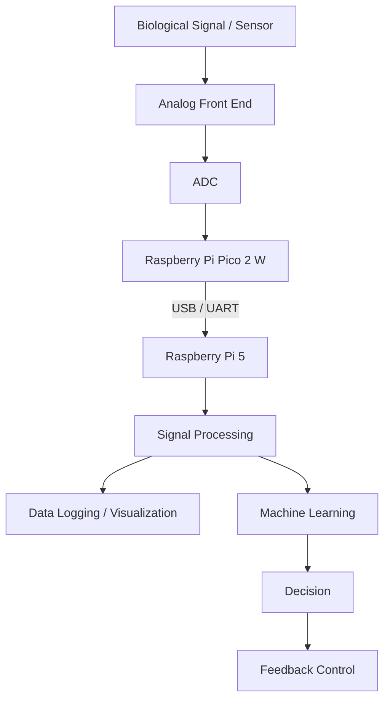
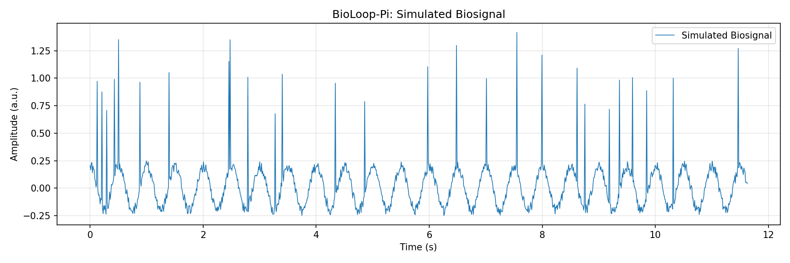

# BioLoop-Pi

A modular bioelectronic interface project for **biosignal acquisition, signal processing, machine learning, and closed-loop feedback**.

BioLoop-Pi is being developed as a hands-on platform for exploring how embedded hardware and computational methods can be connected to biological signals, with a long-term interest in **neural interfaces and living-hybrid bioelectronic systems**.

---

## Overview

BioLoop-Pi uses a **Raspberry Pi 5** and **Raspberry Pi Pico 2 W** as the initial hardware platform.

The project begins with basic communication and simulated signals and will gradually progress toward:

**Signal Acquisition → Data Transfer → Signal Processing → Machine Learning → Closed-Loop Feedback**

Rather than starting directly with complex neural hardware, the project is designed to build and validate each engineering layer independently before integrating them into a complete system.

---

## Motivation

Bioelectronic and neural-interface systems require multiple engineering layers to work together:

- sensing biological signals
- analog and digital signal acquisition
- embedded communication
- real-time signal processing
- feature extraction and interpretation
- feedback generation

The goal of BioLoop-Pi is to build these layers step by step and use the resulting platform as a foundation for future work involving **biosignals, neural interfaces, multi-electrode arrays (MEA), and living-hybrid systems**.

---

## System Architecture



The initial implementation currently focuses on the communication layer between the **Pico 2 W** and **Raspberry Pi 5**.

>The diagram represents the planned system architecture. The current prototype implements simulated signal generation, USB serial communication, data logging, and static visualization.

---

## Current Progress

### Raspberry Pi Pico 2 W

The Pico serves as the embedded-side controller responsible for generating and transmitting simulated biosignal data.

Implemented features:

- MicroPython development environment
- Pico-side `main.py` execution
- Simulated biosignal generation
- USB CDC serial communication
- Timestamped signal transmission

### Raspberry Pi 5

The Raspberry Pi serves as the edge processing and data acquisition platform.

Implemented features:

- Raspberry Pi OS environment setup
- SSH-based development
- USB serial communication through `/dev/ttyACM0`
- Serial data reception using PySerial
- CSV data logging
- Sampling rate measurement
- Static signal visualization using Matplotlib

The current implementation supports the following pipeline:

**Signal Generation → USB Serial Transmission → CSV Data Logging → Signal Visualization**

The next steps focus on sampling timing analysis, real-time visualization, and improved signal acquisition.

---

## Hardware

### Current Platform

- Raspberry Pi 5 — 4 GB
- Raspberry Pi Pico 2 W
- Breadboard
- Jumper wires
- Resistor kit
- USB data cable

### Planned Extensions

Hardware will be added only when required by later phases of the project.

Possible additions include:

- external ADC
- biosignal analog front-end
- EMG / ECG sensors
- additional bioelectronic sensors
- multi-channel acquisition hardware

---

## Software

### Current

- Python
- MicroPython
- PySerial
- Matplotlib
- Raspberry Pi OS
- Git / GitHub

### Planned

- NumPy
- SciPy
- Jupyter Notebook
- PyTorch

These tools will be introduced as the project progresses into advanced signal processing and machine-learning stages.

---

## Project Roadmap

### Phase 0 — Project Setup

- [x] Create the project repository
- [x] Initialize Git
- [x] Connect the local repository to GitHub
- [x] Set up the initial directory structure
- [x] Prepare Raspberry Pi 5 development environment
- [x] Prepare Raspberry Pi Pico 2 W development environment

### Phase 1 — Communication, Logging & Visualization

- [x] Connect Pico 2 W to Raspberry Pi 5
- [x] Establish USB serial communication
- [x] Create Pico-side execution workflow
- [x] Create Raspberry Pi serial receiver
- [x] Validate basic data reception
- [x] Define a stable signal-data format
- [x] Generate simulated biosignal data
- [x] Implement CSV data logging
- [x] Measure actual average sampling rate
- [x] Visualize recorded signals using Matplotlib
- [ ] Analyze sampling rate and timing jitter
- [ ] Implement real-time signal visualization

### Phase 2 — Signal Acquisition

- [ ] Read analog signals
- [ ] Evaluate ADC requirements
- [ ] Integrate an external ADC if required
- [ ] Acquire real sensor data
- [ ] Store recorded signals with timestamps and metadata

### Phase 3 — Signal Processing

- [ ] Signal preprocessing
- [ ] Digital filtering
- [ ] Frequency-domain analysis
- [ ] FFT analysis
- [ ] Feature extraction
- [ ] Noise and artifact analysis

### Phase 4 — Machine Learning

- [ ] Prepare biosignal datasets
- [ ] Build a PyTorch processing pipeline
- [ ] Establish baseline classification models
- [ ] Explore 1D CNN-based signal classification
- [ ] Evaluate model performance
- [ ] Run inference on Raspberry Pi 5

### Phase 5 — Closed-Loop Feedback

- [ ] Detect a target signal state
- [ ] Generate feedback decisions
- [ ] Send control commands to the Pico
- [ ] Control an external output device
- [ ] Measure end-to-end system latency
- [ ] Evaluate closed-loop behavior

## Experimental Results

### Phase 1 — Simulated Biosignal Acquisition

The initial BioLoop-Pi prototype successfully established USB serial communication between Raspberry Pi Pico 2 W and Raspberry Pi 5.

The Pico generates a simulated biosignal containing a 2 Hz sinusoidal component, random noise, and occasional burst-like events.

The Raspberry Pi receives the signal and records timestamped samples in CSV format.

**Data Logging Results**

| Parameter | Result |
|---|---|
| Target Sampling Rate | 100 Hz |
| Measured Sampling Rate | 95.820 Hz |
| Mean Sampling Interval | 10.436 ms |
| Minimum Sampling Interval | 10 ms |
| Maximum Sampling Interval | 16 ms |
| Recorded Samples | 1,115 |
| Sampling Rate Error | 4.18% |

The measured sampling rate was approximately 4.18% lower than the target frequency.

This discrepancy is likely associated with execution overhead from signal generation, USB serial transmission, and the delay-based sampling implementation.

Further timing analysis and improvements are planned.

### Signal Visualization

The recorded signal is visualized using Python and Matplotlib.



*Figure 1. Time-domain visualization of the simulated biosignal acquired through the BioLoop-Pi data logging pipeline.*

### Development Logs

Detailed implementation notes and experimental records are available in the [`docs/devlog`](docs/devlog/) directory.

---

## Repository Structure

```text
BioLoop-Pi/
├── README.md
├── .gitignore
│
├── pico/
│   ├── hello_pico.py
│   └── signal_generator.py
│
├── raspberry_pi/
│   ├── receiver.py
│   ├── logger.py
│   └── plot_signal.py
│
├── data/
│   ├── raw/
│   └── processed/
│
├── docs/
│   ├── devlog/
│   └── images/
│       └── phase1-6-signal-visualization.png
│
└── notebooks/
```

Raw and processed experimental data are excluded from Git tracking.

Selected visualization results are stored in `docs/images/` for documentation purposes.

The Pico-side `signal_generator.py` is deployed as `main.py` on the Pico 2 W.

---

## Future Research Direction

BioLoop-Pi is currently an engineering prototype rather than a neural-interface system.

As the underlying acquisition and processing pipeline becomes more mature, possible future directions include:

- real-time biosignal processing
- multi-channel signal acquisition
- neural spike detection
- neural signal classification
- neural decoding
- MEA-compatible data processing
- closed-loop neural interfaces
- living-hybrid bioelectronic systems

The long-term objective is to use the project as a practical engineering foundation for studying interfaces between **biological neural systems and electronic hardware**.

---

## Project Status

**Current Stage: Phase 1 — Communication, Logging & Visualization**

The BioLoop-Pi prototype currently supports:

- Simulated biosignal generation on Raspberry Pi Pico 2 W
- USB serial communication with Raspberry Pi 5
- CSV data logging
- Static signal visualization
- Average sampling rate measurement

The most recent experiment recorded 1,115 samples at an average sampling rate of approximately 95.82 Hz.

**Next Milestones:**

- Analyze sampling interval variability and jitter
- Improve sampling timing accuracy
- Implement real-time signal visualization

---

> This project is an experimental and educational research platform. It is not intended for clinical or diagnostic use.
