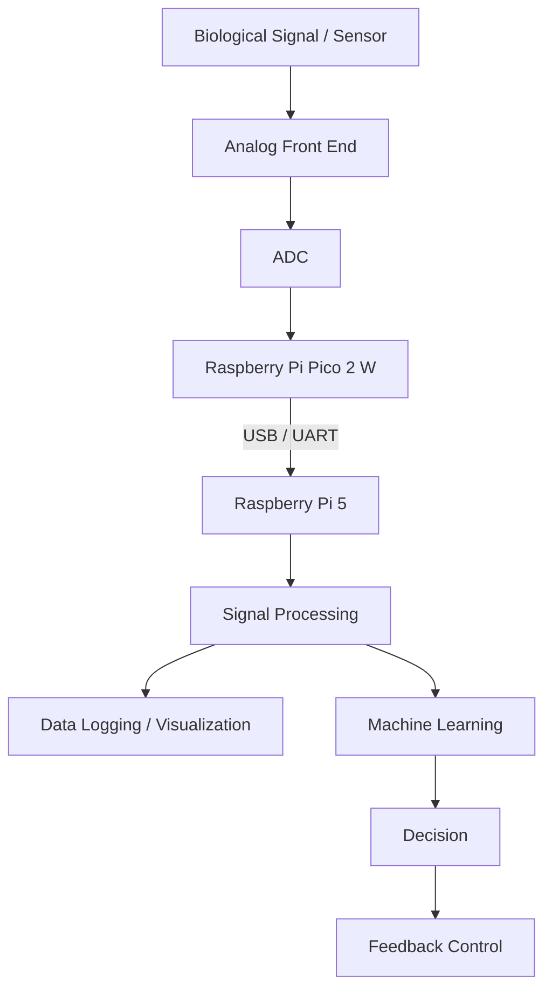

# BioLoop-Pi

A modular bioelectronic interface project for **biosignal acquisition, signal processing, machine learning, and closed-loop feedback**.

BioLoop-Pi is being developed as a hands-on platform for exploring how embedded hardware and computational methods can be connected to biological signals, with a long-term interest in **neural interfaces and living-hybrid bioelectronic systems**.

---

## Overview

BioLoop-Pi uses a **Raspberry Pi 5** and **Raspberry Pi Pico 2 W** as the initial hardware platform.

The project begins with basic communication and simulated signals and will gradually progress toward:

**Signal Acquisition → Data Transfer → Signal Processing → Machine Learning → Closed-Loop Feedback**

Rather than starting directly with complex neural hardware, the project is designed to build and validate each engineering layer independently before integrating them into a complete system.

---

## Motivation

Bioelectronic and neural-interface systems require multiple engineering layers to work together:

- sensing biological signals
- analog and digital signal acquisition
- embedded communication
- real-time signal processing
- feature extraction and interpretation
- feedback generation

The goal of BioLoop-Pi is to build these layers step by step and use the resulting platform as a foundation for future work involving **biosignals, neural interfaces, multi-electrode arrays (MEA), and living-hybrid systems**.

---

## System Architecture



The initial implementation currently focuses on the communication layer between the **Pico 2 W** and **Raspberry Pi 5**.

---

## Current Progress

### Raspberry Pi Pico 2 W

The Pico acts as the embedded-side controller responsible for generating or acquiring signal data and transmitting it to the Raspberry Pi.

Current work includes:

- Pico 2 W development environment setup
- MicroPython execution
- USB serial communication
- Pico-side `main.py` execution
- initial signal/data transmission testing

### Raspberry Pi 5

The Raspberry Pi acts as the main processing platform.

Current work includes:

- Raspberry Pi OS environment setup
- SSH-based development
- serial device connection through `/dev/ttyACM0`
- Python serial receiver implementation
- receiving data transmitted from the Pico

Basic communication between the two devices has been validated.

The next step is to establish a consistent signal-data format and use it for **simulated biosignal generation, logging, and real-time visualization**.

---

## Hardware

### Current Platform

- Raspberry Pi 5 — 4 GB
- Raspberry Pi Pico 2 W
- Breadboard
- Jumper wires
- Resistor kit
- USB data cable

### Planned Extensions

Hardware will be added only when required by later phases of the project.

Possible additions include:

- external ADC
- biosignal analog front-end
- EMG / ECG sensors
- additional bioelectronic sensors
- multi-channel acquisition hardware

---

## Software

### Current

- Python
- MicroPython
- PySerial
- Raspberry Pi OS
- Git / GitHub

### Planned

- NumPy
- SciPy
- Matplotlib
- Jupyter Notebook
- PyTorch

These tools will be introduced as the project progresses into signal processing and machine-learning stages.

---

## Project Roadmap

### Phase 0 — Project Setup

- [x] Create the project repository
- [x] Initialize Git
- [x] Connect the local repository to GitHub
- [x] Set up the initial directory structure
- [x] Prepare Raspberry Pi 5 development environment
- [x] Prepare Raspberry Pi Pico 2 W development environment

### Phase 1 — Pico ↔ Raspberry Pi Communication

- [x] Connect Pico 2 W to Raspberry Pi 5
- [x] Establish USB serial communication
- [x] Create Pico-side execution workflow
- [x] Create Raspberry Pi serial receiver
- [x] Validate basic data reception
- [ ] Define a stable signal-data format
- [ ] Generate simulated biosignal data
- [ ] Visualize the incoming signal in real time

### Phase 2 — Signal Acquisition

- [ ] Read analog signals
- [ ] Evaluate ADC requirements
- [ ] Integrate an external ADC if required
- [ ] Acquire real sensor data
- [ ] Store recorded signals with timestamps and metadata

### Phase 3 — Signal Processing

- [ ] Signal preprocessing
- [ ] Digital filtering
- [ ] Frequency-domain analysis
- [ ] FFT analysis
- [ ] Feature extraction
- [ ] Noise and artifact analysis

### Phase 4 — Machine Learning

- [ ] Prepare biosignal datasets
- [ ] Build a PyTorch processing pipeline
- [ ] Establish baseline classification models
- [ ] Explore 1D CNN-based signal classification
- [ ] Evaluate model performance
- [ ] Run inference on Raspberry Pi 5

### Phase 5 — Closed-Loop Feedback

- [ ] Detect a target signal state
- [ ] Generate feedback decisions
- [ ] Send control commands to the Pico
- [ ] Control an external output device
- [ ] Measure end-to-end system latency
- [ ] Evaluate closed-loop behavior

---

## Repository Structure

```text
BioLoop-Pi/
├── README.md
├── .gitignore
├── pico/
│   └── main.py
├── raspberry_pi/
│   └── receiver.py
└── docs/
    └── devlog/
```

Additional directories such as `data/`, `notebooks/`, and experiment-specific folders will be added when they are actually needed.

---

## Development Log

Development notes are maintained in:

[`docs/devlog/`](docs/devlog/)

The devlog records implementation progress, hardware setup, communication tests, problems encountered, and design decisions made during development.

---

## Future Research Direction

BioLoop-Pi is currently an engineering prototype rather than a neural-interface system.

As the underlying acquisition and processing pipeline becomes more mature, possible future directions include:

- real-time biosignal processing
- multi-channel signal acquisition
- neural spike detection
- neural signal classification
- neural decoding
- MEA-compatible data processing
- closed-loop neural interfaces
- living-hybrid bioelectronic systems

The long-term objective is to use the project as a practical engineering foundation for studying interfaces between **biological neural systems and electronic hardware**.

---

## Project Status

**Current Stage: Phase 1 — Pico ↔ Raspberry Pi Communication**

Basic USB serial communication between the Raspberry Pi Pico 2 W and Raspberry Pi 5 has been established.

**Next milestone:**
Generate a structured simulated biosignal stream and visualize the received signal in real time on the Raspberry Pi 5.

---

> This project is an experimental and educational research platform. It is not intended for clinical or diagnostic use.
